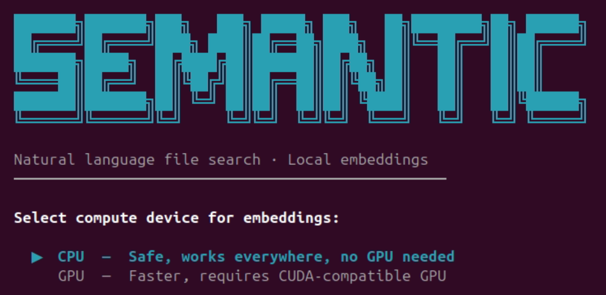
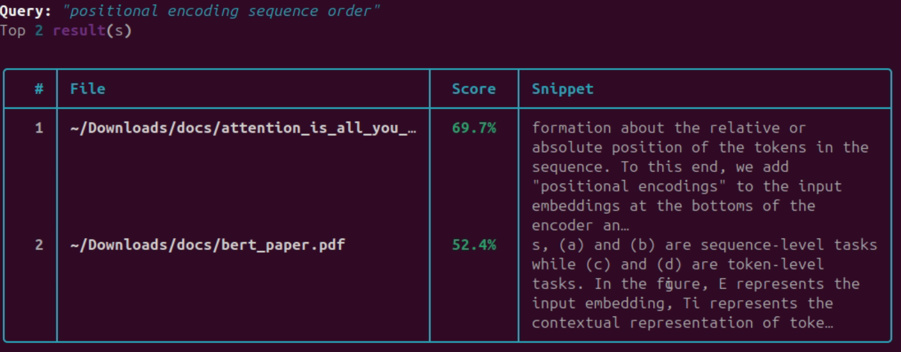

# SemanticSeek 

> Natural language file search powered by local embeddings. No API keys, no internet required after setup.

Instead of grepping for exact words, SemanticSeek understands **meaning**. Ask it things like:

```
semanticseek search "where did I write about network timeouts"
semanticseek search "meeting notes about the budget"
semanticseek search "something about deploying to production"
```

---
## GPU / CPU Selection

---
## Example Query


## Features

- 🧠 **Semantic search** — finds documents by meaning, not just keywords
- 📄 **Supports `.txt`, `.md`, `.pdf`** — common document formats
- 💾 **Fully local** — embeddings stored in a local ChromaDB database
- ⚡ **CPU-only** — runs on any machine, no GPU required
- 🎨 **Beautiful TUI** — rich terminal interface with progress bars and tables
- 📦 **Single install script** — one `curl` command to get started

---

## Install

```bash
curl -fsSL https://raw.githubusercontent.com/Arman-Ispiryan/semanticseek/main/install.sh | bash
```

That's it. The script will:
1. Check for Python 3.9+
2. Create a virtualenv at `~/.semanticseek/venv`
3. Install the package and all dependencies
4. Symlink `semanticseek` to `/usr/local/bin`

> **First run** will download the `all-MiniLM-L6-v2` model (~90MB). After that, everything is offline.

---

## Usage

### Index a folder

```bash
semanticseek index ~/Documents
semanticseek index /mnt/notes --db ~/.myindex   # custom DB location
semanticseek index ~/Documents --force          # re-index everything
```

### Search

```bash
semanticseek search "quarterly revenue report"
semanticseek search "notes about docker networking" --top 10
semanticseek search "budget meeting" --no-snippet
```

### Check status

```bash
semanticseek status
```

### Clear the index

```bash
semanticseek clear
```

---

## How it works

1. **Indexing**: Each document is extracted, cleaned, and split into overlapping chunks
2. **Embedding**: Each chunk is encoded with `all-MiniLM-L6-v2` (a 22M parameter model that runs fast on CPU)
3. **Storage**: Embeddings are stored in a local ChromaDB vector database at `~/.semanticseek/db`
4. **Search**: Your query is embedded and compared against all chunks using cosine similarity
5. **Results**: Best-matching chunk per file is returned, deduplicated and ranked by score

---

## Dependencies

| Package | Purpose |
|---|---|
| `sentence-transformers` | Local embedding model |
| `chromadb` | Vector database |
| `pymupdf` | PDF text extraction |
| `typer` | CLI framework |
| `rich` | Terminal UI |

---

## License

MIT
